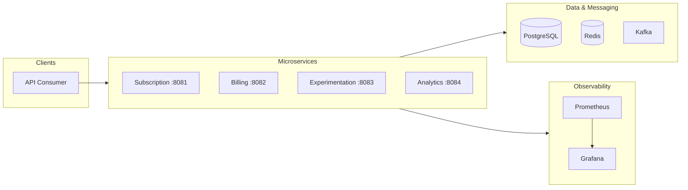
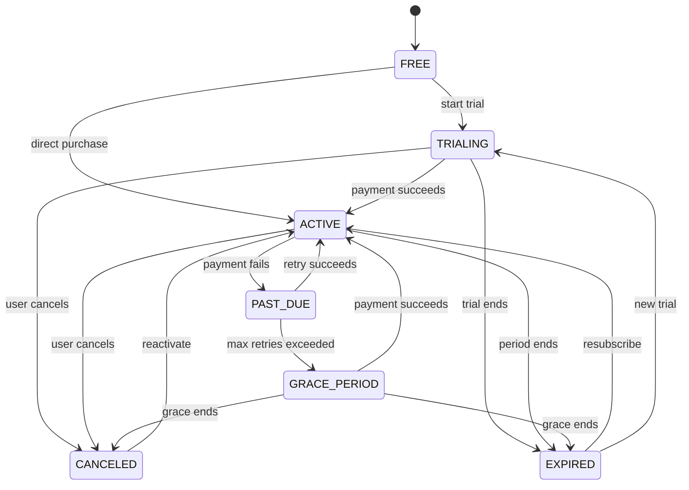
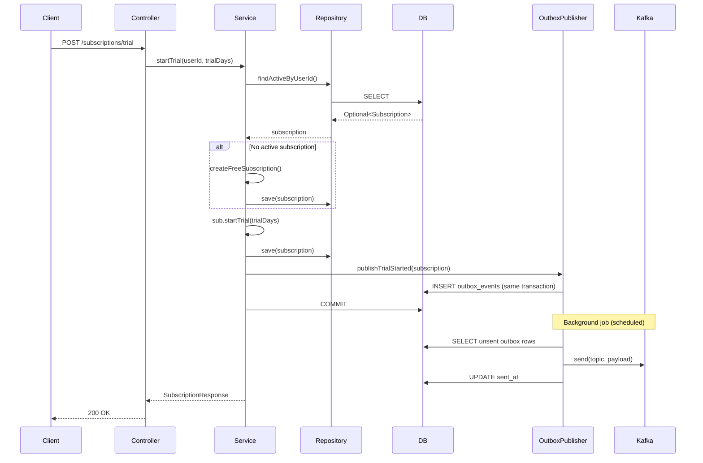
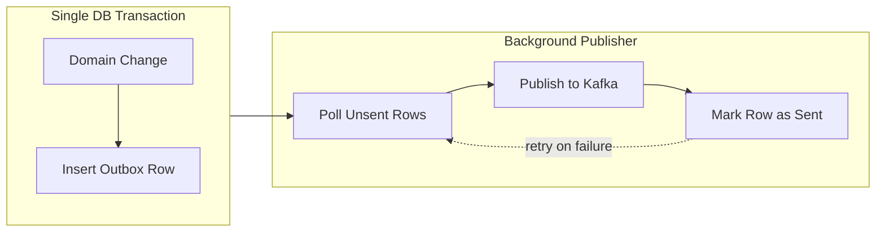

# Subscription & Experimentation Platform

A **production-style, Spotify-like backend platform** for subscription lifecycle management, billing/payments, and A/B experimentation. Built as a portfolio project to demonstrate enterprise-grade backend architecture, event-driven design, and operational readiness.

---

## What This Project Demonstrates

| Area | What I Built |
|------|--------------|
| **Domain modeling** | Explicit subscription state machine with enforced transitions (FREE → TRIALING → ACTIVE → PAST_DUE → GRACE_PERIOD → CANCELED/EXPIRED) |
| **Event-driven architecture** | Kafka + transactional Outbox pattern for reliable event publishing |
| **Idempotency** | Payment confirmation endpoints with `Idempotency-Key` header and DB-backed deduplication |
| **Concurrency safety** | Optimistic locking (`@Version`) and pessimistic locking (`SELECT FOR UPDATE`) for subscription state |
| **Observability** | Micrometer metrics, Prometheus, Grafana dashboards, structured logging with trace IDs |
| **Testing** | Unit tests for domain logic, integration tests with Testcontainers (Postgres, Kafka, Redis) |
| **Clean architecture** | Layered design: Controller → Application Service → Domain → Repository |

---

## System Architecture



---

## Subscription Lifecycle (State Machine)



| Status | Description |
|--------|-------------|
| **FREE** | No paid subscription |
| **TRIALING** | In trial period (e.g., 14 days) |
| **ACTIVE** | Paid, current subscription |
| **PAST_DUE** | Payment failed; system retrying (1h, 6h, 24h) |
| **GRACE_PERIOD** | Max retries exceeded; final grace before cancel |
| **CANCELED** | User or system canceled |
| **EXPIRED** | Period ended without renewal |

---

## Request Flow: Start Trial → Kafka Event



---

## Outbox Pattern (Reliable Event Publishing)



**Why Outbox?** Domain changes and outbox inserts happen in the same transaction. If the transaction commits, the event is guaranteed to be published eventually. No "write to DB then fail to publish to Kafka" inconsistency.

---

## Tech Stack

| Layer | Technology | Purpose |
|-------|------------|---------|
| **Runtime** | Java 21, Spring Boot 3.3+ | LTS, modern language features |
| **Build** | Maven | Dependency management, multi-module |
| **Database** | PostgreSQL 16 | Primary data store |
| **Migrations** | Flyway | Versioned schema changes |
| **ORM** | Spring Data JPA (Hibernate) | Persistence |
| **Cache** | Redis | Caching, optional distributed locks |
| **Messaging** | Apache Kafka | Event-driven flows |
| **Metrics** | Micrometer + Prometheus | Observability |
| **Dashboards** | Grafana | Visualization |
| **Tracing** | OpenTelemetry | Distributed tracing (basic setup) |
| **Testing** | JUnit 5, Testcontainers | Unit + integration tests |

---

## Repository Structure

```
subscription-platform/
├── pom.xml                          # Parent POM (Spring Boot 3.3.5, Java 21)
├── README.md
├── docs/
│   ├── architecture.md              # Architecture details
│   └── runbook.md                   # On-call troubleshooting
├── infra/
│   ├── docker-compose.yml           # Postgres, Redis, Kafka, Prometheus, Grafana
│   ├── prometheus.yml               # Scrape configs
│   └── grafana/provisioning/        # Datasources + sample dashboards
└── services/
    ├── subscription-service/        # Subscription lifecycle (port 8081)
    │   ├── src/main/java/.../domain/       # Entities, state machine
    │   ├── src/main/java/.../application/  # Application services
    │   ├── src/main/java/.../api/          # Controllers, DTOs
    │   ├── src/main/java/.../repository/    # JPA repositories
    │   ├── src/main/java/.../infrastructure/ # Outbox publisher
    │   └── src/main/resources/db/migration/ # Flyway migrations
    ├── billing-service/             # Payments, idempotency (port 8082)
    ├── experimentation-service/     # A/B experiments (port 8083)
    └── analytics-service/           # Event analytics (port 8084)
```

---

## API Overview

### Subscription Service (implemented)

| Method | Endpoint | Description |
|--------|----------|-------------|
| GET | `/subscriptions/me?userId=...` | Get current subscription |
| POST | `/subscriptions/trial` | Start trial |
| POST | `/subscriptions/cancel` | Cancel (immediate or at period end) |
| POST | `/subscriptions/reactivate` | Reactivate canceled subscription |

### Billing Service (planned)

| Method | Endpoint | Description |
|--------|----------|-------------|
| POST | `/billing/payment-intents` | Create payment intent |
| POST | `/billing/payment-intents/{id}/confirm` | Confirm payment (requires `Idempotency-Key`) |
| POST | `/billing/webhooks/payment-succeeded` | Simulated provider callback |
| POST | `/billing/webhooks/payment-failed` | Simulated failure callback |

### Experimentation Service (planned)

| Method | Endpoint | Description |
|--------|----------|-------------|
| POST | `/experiments` | Create experiment |
| POST | `/experiments/{key}/start` | Start experiment |
| GET | `/experiments/decide?userId=...&key=...` | Get variant assignment |

---

## Quick Start

### 1. Start Infrastructure

```bash
docker compose -f infra/docker-compose.yml up -d
```

Wait for Postgres, Kafka, Redis, Prometheus, and Grafana to be healthy.

### 2. Run Subscription Service

```bash
mvn -pl services/subscription-service spring-boot:run
```

Service runs on **http://localhost:8081**

### 3. Example API Calls

**Start trial:**
```bash
curl -X POST http://localhost:8081/subscriptions/trial \
  -H "Content-Type: application/json" \
  -d '{"userId": "550e8400-e29b-41d4-a716-446655440000", "trialDays": 14}'
```

**Get subscription:**
```bash
curl "http://localhost:8081/subscriptions/me?userId=550e8400-e29b-41d4-a716-446655440000"
```

**Cancel (at period end):**
```bash
curl -X POST http://localhost:8081/subscriptions/cancel \
  -H "Content-Type: application/json" \
  -d '{"userId": "550e8400-e29b-41d4-a716-446655440000", "atPeriodEnd": true}'
```

**Reactivate:**
```bash
curl -X POST http://localhost:8081/subscriptions/reactivate \
  -H "Content-Type: application/json" \
  -d '{"userId": "550e8400-e29b-41d4-a716-446655440000"}'
```

---

## Running Tests

```bash
# All tests (all services)
mvn test

# Subscription service only
mvn -pl services/subscription-service test

# Unit tests only (no Testcontainers)
mvn -pl services/subscription-service test -Dtest=SubscriptionStateMachineTest,SubscriptionTest

# Integration tests (Postgres + Kafka + Redis via Testcontainers)
mvn -pl services/subscription-service test -Dtest=SubscriptionServiceIntegrationTest
```

---

## Observability

| Endpoint | URL |
|----------|-----|
| Health check | http://localhost:8081/actuator/health |
| Prometheus metrics | http://localhost:8081/actuator/prometheus |
| Prometheus UI | http://localhost:9090 |
| Grafana | http://localhost:3000 (admin/admin) |

**Key metrics:**
- `subscriptions_state_transition_total{from,to}` — subscription state changes
- `billing_payment_success_total` — successful payments
- `billing_payment_failure_total{code}` — failed payments by failure code
- `experiments_exposures_total{key,variant}` — experiment exposures

---

## Error Handling

All API errors return **RFC 7807 Problem Details** (`application/problem+json`):

```json
{
  "type": "https://api.subscription-platform.com/errors/404",
  "title": "Not Found",
  "status": 404,
  "detail": "No subscription found for user ...",
  "timestamp": "2025-02-24T12:00:00Z",
  "traceId": "a1b2c3d4e5f6"
}
```

---

## Documentation

- **[docs/architecture.md](docs/architecture.md)** — Architecture details, database strategy, Kafka topics
- **[docs/runbook.md](docs/runbook.md)** — On-call troubleshooting, common issues, useful queries

---

## License

MIT (or as appropriate for your portfolio)
